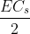
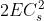
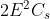

## Post test
 

Q 1. The energy is stored in Flywheel in form of 
a. Potential energy 
<b>b. Kinetic energy</b> 
c. Heat energy 
d. Electrical energy  

Q 2. With usual notations for different parameters involved, the maximum fluctuations of energy for a flywheel is given by 
<b>a. </b> 
b.  
c.  
d.   

Q 3. Flywheel are generally made from 
a. Cast Iron 
b. High strength steel 
c. Ceramics 
<b>d. All of the above</b>  

Q 4. The difference the maximum and minimum speeds during a cycle is called 
a. Fluctuation of speed 
<b>b. Maximum fluctuation of speed</b> 
c. Coefficient of fluctuation of speed 
d. None of the above  

Q 5. A flywheel connected to a punching machine has to supply energy of 160 Nm while running at a mean angular speed of 12 rad/s. If the total fluctuation of speed is not exceeded to ±1.75%, the mass moment of inertia of the flywheel in kgm2 is 
a. 56.25 
b. 135.39 
<b>c. 31.75</b> 
d. 23.95  
