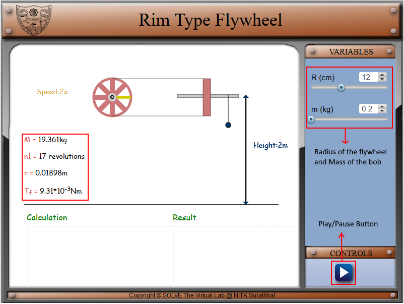
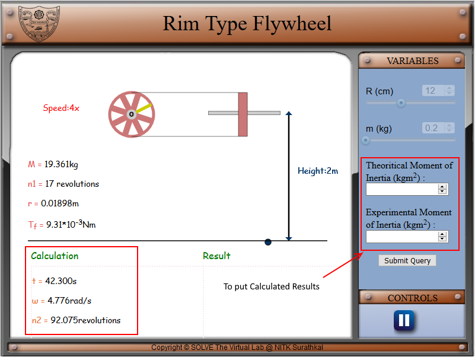
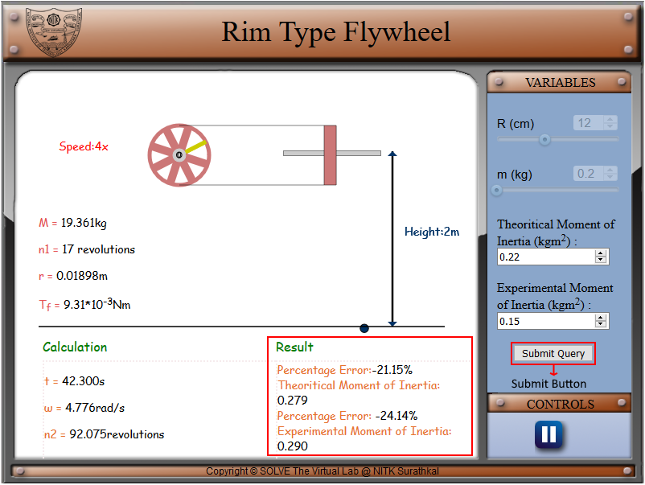

#### These procedure steps will be followed on the simulator

1. In simulation window the experimental setup of the rim type flywheel with a string attached to the axle with mass is shown in front and side view. 
 

2. There are pointersgiven on right side of the screen for choosing the values of input variables, viz., radius if the disc type flywheel (R) and mass of the metal bob (m). there is a play/pause button under control tab for staring the experiment. The information about the experimental setup is given under the experimental setup. 
 

3. After initiating the simulation with the help of the play button under the control tab, two option will come under the variable tab to enter the value of experimental and theoretical value of moment of inertia. Under calculation column it will show the time required for bob to touch the ground(t), angular velocity of flywheel at the instant when the mass touches the ground(ω), number of rotations made by the flywheel after the string has left the axle (n2). 
 

4. Click on submit to submit button under variable tab and the correct results will display under the results column with the percentage of error made by the user in calculations. 
 

5. Compare analytically calculated results and the error in the result with the simulation results, displayed in the bottom of the simulator page. 
