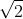
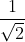
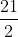

## <b> Pre-test</b>
#### Please attempt the following questions

Q 1. What is the value of the radius of gyration of rim type flywheel as compared to a disc type flywheel for the same diameter? 
<b>a.  times</b> 
b.  times 
c. 2 times 
d.  times  

Q 2. what is the value of the radius of gyration of the rim type flywheel as compared to disc type flywheel for the same diameter? 
<b>a.  times</b> 
b.  times 
c. 2 times 
d.  times  

Q 3. What is the moment of inertia of rim type of flywheel? 
<b>a. I= Mr2</b> 
b. I=0.5&lowast;Mr2 
c. I=2&lowast;Mr2 
d. I=0.4&lowast;Mr2  

Q 4. Which of the following statements are correct? 
Statement A: To absorb energy when demand of energy id less than the supply 
Statement B: To give out energy when demand of energy is more than the supply. 

a. A is correct and B is wrong 
b. B is correct and A is wrong 
<b>c. Both A and B are correct</b> 
d. Both A and B are wrong  
